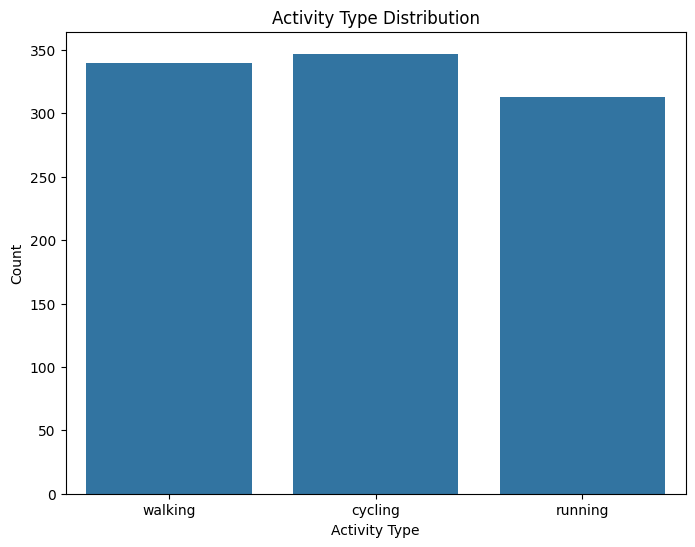
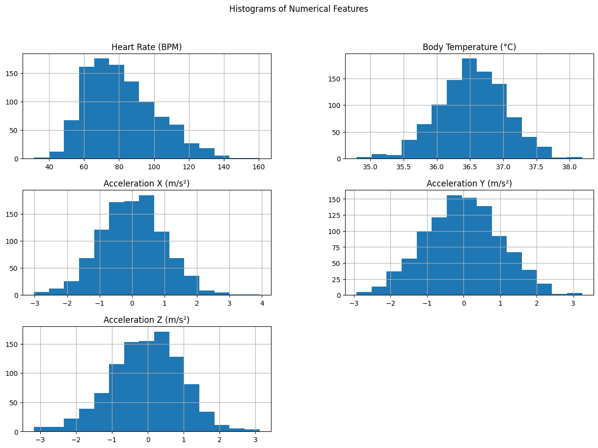
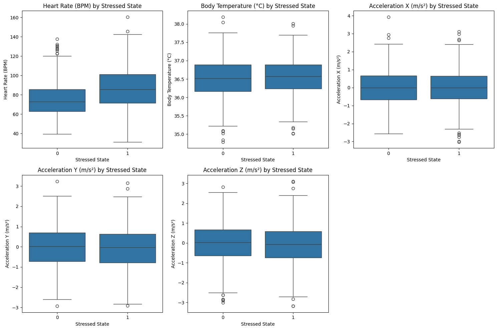
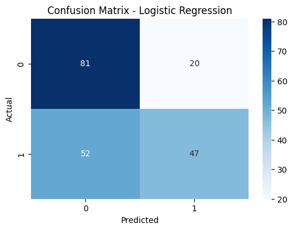
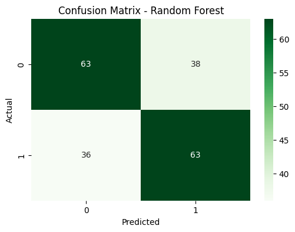

# Wearable Device Data Analysis 


## Dataset Overview :

This dataset contains  signals collected by wearable devices that monitor various human activities and vital signs. It includes time series data for activities like walking, running, sitting, and vital signs such as heart rate and body temperature, recorded over different intervals.

Features:

- Activity Type: Categorical variable indicating the type of activity (e.g., walking, running, sitting, etc.).
- Heart Rate (BPM): Continuous variable representing beats per minute.
- Body Temperature (°C): Continuous variable representing the user's body temperature.
- Acceleration (m/s²): Three continuous variables representing acceleration on the x, y, and z axes.
- Timestamp: Time variable indicating when the reading was taken.


## Setup environment : 

On commence par créer un environement virtuel en utilisant venv :

```
python -m venv tp1
```

après on active cet environement : 

vu que je travaille avec un mac j'utilise : 
```
source tp1/bin/activate
```
après installer fichier requirements.txt :

```
pip install -r requirements.txt
```

## Description :

### Préparation des données :

data.info() : permet de  Vérifier la structure générale du DataFrame et les informations sur les colonnes

 ###### Résultat : 
 - Il y a 1000 lignes dans ce DataFrame, indexées de 0 à 999.
 - Le DataFrame contient 7 colonnes.
 - Activity type il est lu comme objet donc on change son type à String par : 

 ```python  
data['Activity Type'] = data['Activity Type'].astype('string') 
 ```
la fonction describe() permet de synthétiser : 
###### Heart Rate (BPM) (Fréquence cardiaque en battements par minute) :

- count : 1000, ce qui indique qu'il n'y a pas de valeurs manquantes.
- mean : 81.51, ce qui est la fréquence cardiaque moyenne.
- std : 19.84, la variabilité de la fréquence cardiaque est modérée.
- min : 31.30 et max : 160.41, le rythme cardiaque varie dans une large gamme.

###### Body Temperature (°C) (Température corporelle) :

- count : 1000, pas de valeurs manquantes.
- mean : 36.53, la température moyenne est proche de la normale.
- std : 0.51, indique une faible variabilité autour de la température moyenne.
- min : 34.79 et max : 38.19, la plage est raisonnable pour des températures corporelles humaines.
- Quartiles : La médiane de 36.54 est proche de la moyenne, montrant une distribution centrée.

###### Acceleration X (m/s²), Acceleration Y (m/s²), Acceleration Z (m/s²) (Accélérations sur les axes X, Y et Z) :

- count : 1000 pour chaque axe, donc aucune donnée manquante.
- mean : Les valeurs moyennes sont proches de 0 pour les trois axes, ce qui est commun pour les mesures d'accélération sur des données centrées.
- std : Entre 0.98 et 1.02, ce qui montre une dispersion autour de la moyenne sur chaque axe.

###### Stressed State (État de stress, booléen) :

- count : 1000, donc toutes les valeurs sont présentes.
- mean : 0.506, montrant que près de 50 % des observations sont dans un état de stress (1) et 50 % dans un état non stressé (0).
- std : 0.5, indiquant une variabilité complète, ce qui est typique d'une variable binaire avec des catégories équilibrées.
- min, max, quartiles : Les valeurs de 0 et 1 sont équilibrées,

#### Pour vérifier si vraiment il n'exite pas des valeurs nulles : 
data.isnull().sum() : qui donne 0 valeurs nulles

### Explore and Visualize the Data
Ce graphique est utile pour vérifier l'équilibre entre les différentes catégories de types d'activités.




- Heart Rate (BPM) :La fréquence cardiaque se situe principalement entre 60 et 100 BPM, avec une distribution légèrement asymétrique, concentrée autour de la moyenne d'environ 80 BPM.
La majorité des valeurs se trouvent dans la fourchette de 60 à 100 BPM, avec quelques valeurs extrêmes en dehors de cet intervalle.
Body Temperature (°C) :

- La température corporelle suit une distribution symétrique, avec un pic autour de 36,5 °C.
La majorité des valeurs se situent entre 35,5 °C et 37,5 °C, représentant une répartition normale de la température corporelle humaine.
Acceleration X (m/s²), Acceleration Y (m/s²) et Acceleration Z (m/s²) :

- Les trois axes d'accélération montrent une distribution similaire, qui est centrée autour de 0 m/s² et présente une forme symétrique.



- Heart Rate (BPM) : La fréquence cardiaque semble plus élevée pour l'état de stress (1) par rapport à l'état sans stress (0).
On observe des valeurs aberrantes pour les deux états, mais elles sont plus nombreuses pour l'état de stress.
Body Temperature (°C) :

- La température corporelle est légèrement plus élevée en moyenne pour l'état de stress par rapport à l'état sans stress.
Quelques valeurs aberrantes apparaissent dans les deux états, surtout dans les valeurs basses.
Acceleration X (m/s²), Acceleration Y (m/s²) et Acceleration Z (m/s²) :

- Les trois axes d'accélération présentent des distributions similaires pour les deux états de stress, sans grande variation notable.
On note également des valeurs aberrantes pour les deux états, mais elles sont relativement équilibrées.

##  Data Preprocessing


 ```python  
X = df.drop('Stressed State', axis=1)
y = df['Stressed State']
 ```

X contient toutes les colonnes sauf 'Stressed State', tandis que y contient uniquement la colonne 'Stressed State', qui est la variable cible.
 ```python 
# We split the data: 80% training and 20% test
X_train, X_test, y_train, y_test = train_test_split(X, y, test_size=0.2, random_state=42 )
 ```

 ## Model Training : 
 #### Logistic Regression :
 ```python 
from sklearn.linear_model import LogisticRegression
from sklearn.ensemble import RandomForestClassifier

# On entraîne le modèle de régression logistique
logreg = LogisticRegression(max_iter=500)
logreg.fit(X_train, y_train)
y_pred_logreg = logreg.predict(X_test)
```

#### Random Forest Classifiers : 
 ```python 
# On entraine le modèle de forêt aléatoire
rf = RandomForestClassifier()
rf.fit(X_train, y_train)
y_pred_rf = rf.predict(X_test)
 ```

## Model Evaluation
## Logistic Regression Metrics

### Accuracy
- **Accuracy**: 0.64


| Class | Precision | Recall | F1-Score | Support |
|-------|-----------|--------|----------|---------|
| 0     | 0.61      | 0.80   | 0.69     | 101     |
| 1     | 0.70      | 0.47   | 0.57     | 99      |

- **Macro avg**: Precision: 0.66, Recall: 0.64, F1-Score: 0.63
- **Weighted avg**: Precision: 0.65, Recall: 0.64, F1-Score: 0.63




## Random Forest Metrics

### Accuracy
- **Accuracy**: 0.63


| Class | Precision | Recall | F1-Score | Support |
|-------|-----------|--------|----------|---------|
| 0     | 0.64      | 0.62   | 0.63     | 101     |
| 1     | 0.62      | 0.64   | 0.63     | 99      |

- **Macro avg**: Precision: 0.63, Recall: 0.63, F1-Score: 0.63
- **Weighted avg**: Precision: 0.63, Recall: 0.63, F1-Score: 0.63




## Amélioration du model :
```python 
from sklearn.preprocessing import StandardScaler

# Normalisation des données
scaler = StandardScaler()
X_train_scaled = scaler.fit_transform(X_train)
X_test_scaled = scaler.transform(X_test)
```